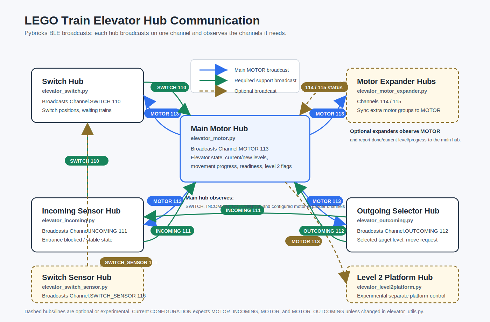
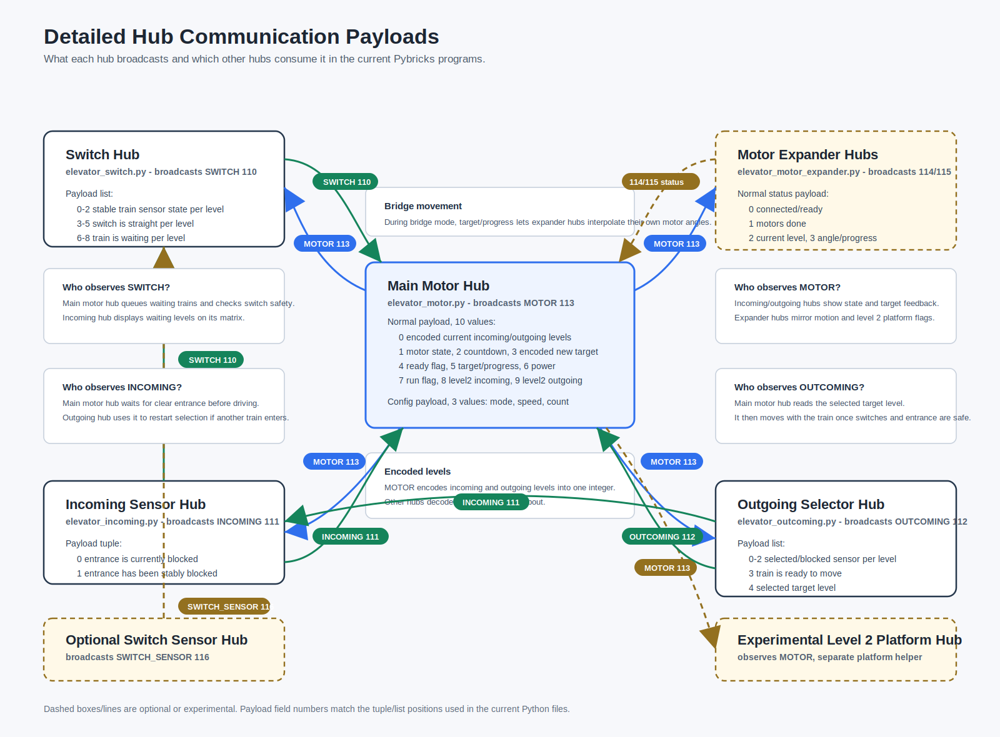
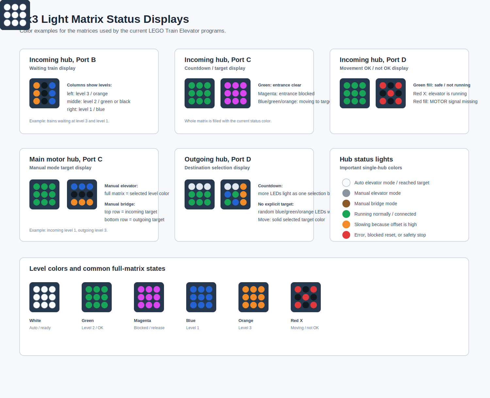
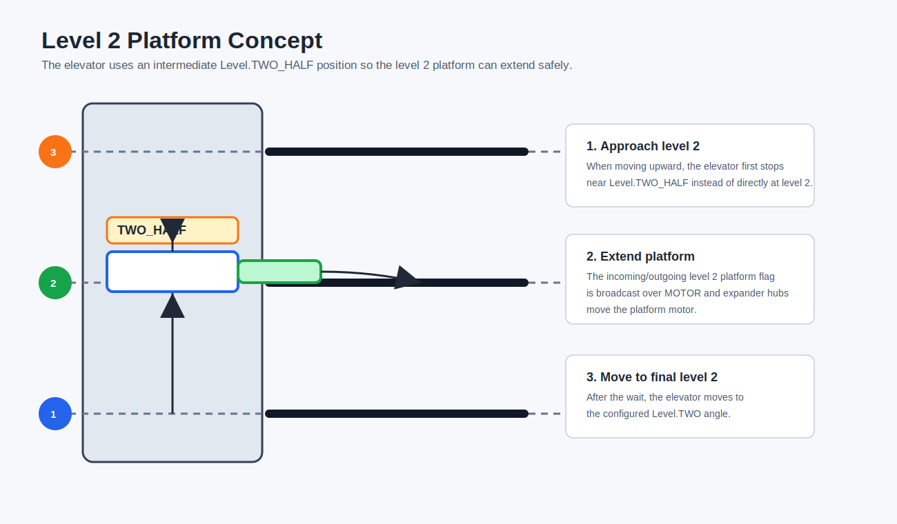

# LEGO Train Elevator

Pybricks programs for a multi-level LEGO train elevator with automatic train pickup,
manual elevator control, bridge-mode alignment, switch control, sensor feedback, and
optional synchronized motor-expander hubs.

This repository documents the current working setup as it exists in the Python files.
Most values are intentionally hard-coded because every physical elevator build has
slightly different geometry, motor orientation, track spacing, and sensor placement.

> Note: This documentation was drafted with AI assistance from the current source
> files and project media. The code itself was written manually. Treat the README
> as generated documentation and adjust the documented calibration/configuration
> values to your own physical build before running trains.

## Showcase Preview


> TODO: Add YouTube video link once published.

## What It Does

The project controls a three-level LEGO train elevator:

- Trains wait at one of three levels.
- The switch hub detects waiting trains and routes tracks.
- The main motor hub moves the elevator to a requested level.
- The incoming sensor hub detects whether a train is entering or blocking the elevator.
- The outgoing hub lets a train select the target level by stopping in front of a
  color/distance sensor assigned to that level.
- Optional motor-expander hubs move additional elevator motor groups in sync with
  the main elevator.
- Optional level 2 platform motors extend/contract a support platform when the
  elevator passes or stops at level 2.

The main controller supports three runtime modes:

- `AUTO_ELEVATOR`: automatic pickup and delivery.
- `MANUAL_ELEVATOR`: manually choose one target level for the whole elevator.
- `MANUAL_BRIDGE`: manually choose different incoming and outgoing levels so the
  elevator acts as a bridge.

## What You Need

The smallest useful setup is the manual elevator. The automatic train pickup and
target-selection features add more hubs and sensors.

The counts below are for the setup shown in the example videos: one main motor hub,
two motor-expander hubs, one switch hub, one incoming hub, one outgoing hub, and the
level 2 platform motors installed on the motor-expander hubs. A smaller build can
use fewer motor hubs and fewer motors.

| Feature set | Required hubs for this example | Motors | Distance sensors | 3x3 color matrices | Remote | What works |
| --- | --- | ---: | ---: | ---: | --- | --- |
| Manual elevator | Main motor hub | 4 elevator motors | 0 | 1 | Required | Move the elevator manually between configured levels. |
| Manual elevator with two extenders | Main motor hub + 2 motor-expander hubs | 12 elevator motors + 2 level-2 platform motors | 0 | 1 | Required | Move the longer/modular elevator manually with synchronized motor sections. |
| Manual bridge mode with two extenders | Main motor hub + 2 motor-expander hubs | 12 elevator motors + 2 level-2 platform motors | 0 | 1 | Required | Move incoming and outgoing sides to different compatible levels. |
| Automatic operation with two extenders | Main motor hub + 2 motor-expander hubs + switch hub + incoming hub + outgoing hub | 12 elevator motors + 2 level-2 platform motors + 3 switch motors | 7 | 5 | Optional | Detect waiting trains, drive to them, select a destination, and release trains automatically. |

Sensor and matrix count for the automatic example:

- 7 distance sensors: 3 switch sensors, 1 incoming entrance sensor, 3 outgoing target
  selection sensors.
- 5 color matrices: 1 main motor status/target matrix, 3 incoming status matrices,
  1 outgoing target/status matrix.
- The LEGO Powered Up remote is optional for fully automatic running, but required
  for manual modes and config mode.

> For the Switch Hub, you additionally need 3 motors and 3 sensors in addition!

Hub requirements:

- The main motor hub and switch hub need six ports because the current programs use
  ports `A` through `F`. Use a Pybricks-compatible six-port hub such as the LEGO
  Technic Large Hub, SPIKE Prime Hub, or MINDSTORMS Robot Inventor Hub.
- MINDSTORMS EV3 / set 31313 is not a drop-in replacement for these programs: the
  code uses the Pybricks Powered Up / SPIKE Prime style APIs and six named ports
  `A` through `F`.
- The incoming and outgoing hubs can be simpler Technic hubs if they provide the
  ports needed by the corresponding program.
- Extra motor expander hubs are optional. They are useful when the elevator is long
  or mechanically split into multiple synchronized sections.

The software is modular around the motor-hub configuration. Adding or removing
motor expander hubs is mostly done by changing `CONFIGURATION` in
`elevator_utils.py` and uploading `elevator_motor_expander.py` with the matching
channel. Changing the number of levels is more work because the level enum, level
angles, color mapping, sensor layout, and selection logic assume three levels. A
two-level version should be relatively simple by not using level 2 or by removing it
from the selectable targets.

## Layout Overview

This photo gives the best high-level orientation before looking at the hub wiring
and BLE communication details. It shows the elevator structure, the colored level
markers, the track approach, and several visible `ColorLightMatrix` status displays.


## Communication Overview

The current setup is designed around Pybricks-compatible LEGO Powered Up hubs.
The exact hub type is less important than the ports and devices connected to each
program.

This is the high-level hub-to-hub communication overview:



Editable HTML version:

[Open the editable hub communication diagram](docs/media/hub-communication-editable.html)

## Hardware Overview

### Required For The Full Automatic Setup

| Role | Program | Purpose |
| --- | --- | --- |
| Main elevator motor hub | `elevator_motor.py` | Main controller, remote handling, elevator state machine, BLE coordinator. |
| Incoming sensor hub | `elevator_incoming.py` | Detects train entering/blocking the elevator and shows waiting/status matrices. |
| Outgoing selection hub | `elevator_outcoming.py` | Detects selected destination level and tells the motor hub where the train wants to go. |
| Switch hub | `elevator_switch.py` | Drives the track switches and reports waiting trains. |

### Optional Or Build-Dependent Hubs

| Role | Program | When To Use |
| --- | --- | --- |
| Incoming motor expander | `elevator_motor_expander.py` | Use when the elevator has additional motor groups on the incoming side. Current file runs this hub by default. |
| Outgoing motor expander | `elevator_motor_expander.py` | Use when the elevator has additional motor groups on the outgoing side. Current file has this line commented out. |
| Switch remote sensor hub | `elevator_switch_sensor.py` | Intended for extra post-switch sensors through `Channel.SWITCH_SENSOR`. This file depends on `switch_small`, which is not included in this repo. |
| Level 2 platform motors | controlled by `elevator_motor_expander.py` in the current setup | Optional mechanical support for level 2. This is independent of automatic/manual/bridge mode and is triggered whenever a move needs the level 2 platform. |
| Separate level 2 platform hub | `elevator_level2platform.py` | Experimental/incomplete helper for a separate level 2 platform hub. The current expander setup controls level 2 platform motors directly instead. |
| LEGO Powered Up remote | connected from `elevator_motor.py` | Optional for automatic operation, but required for manual modes and config mode. |

## Current Default Values

These are the values currently used by `elevator_utils.py`.

### Levels

| Level | Constant | Color | Motor angle |
| --- | --- | --- | --- |
| Level 1 | `Level.ONE` | Blue | `-24400` |
| Level 2 | `Level.TWO` | Green | `200` |
| Level 2 approach | `Level.TWO_HALF` | internal helper | `2000` |
| Level 3 | `Level.THREE` | Orange | `20000` |

`INIT_ANGLE` is `20000`, so the reset/calibration logic treats the top position as
level 3.

The level colors are used by light matrices and by the outgoing destination selector:

- Blue: level 1
- Green: level 2
- Orange: level 3

### BLE Channels

| Channel | Value | Used By |
| --- | ---: | --- |
| `Channel.SWITCH` | `110` | Switch hub broadcasts switch/sensor/waiting state. |
| `Channel.INCOMING` | `111` | Incoming sensor hub broadcasts entrance state. |
| `Channel.OUTCOMING` | `112` | Outgoing selector hub broadcasts target selection. |
| `Channel.MOTOR` | `113` | Main motor hub broadcasts elevator state. |
| `Channel.MOTOR_INCOMING` | `114` | Incoming motor-expander hub. |
| `Channel.MOTOR_OUTCOMING` | `115` | Outgoing motor-expander hub. |
| `Channel.SWITCH_SENSOR` | `116` | Optional remote switch sensors. |
| `Channel.LEVEL_TWO_INCOMING` | `117` | Experimental separate level 2 platform channel. |
| `Channel.LEVEL_TWO_OUTCOMING` | `118` | Experimental separate level 2 platform channel. |

The detailed payload graphic belongs here if you want to understand or modify the
BLE protocol between hubs:



### Current Motor-Hub Configuration

The current configuration is:

```python
CONFIGURATION = [Channel.MOTOR_INCOMING, Channel.MOTOR, Channel.MOTOR_OUTCOMING]
```

This means the full configured elevator expects three synchronized motor groups:

1. Incoming expander hub
2. Main motor hub
3. Outgoing expander hub

The order matters. It is used to calculate each hub's physical position along the
bridge during bridge-mode interpolation.

There are two commented alternatives in `elevator_utils.py`:

```python
# CONFIGURATION = [Channel.MOTOR_INCOMING, Channel.MOTOR]
# CONFIGURATION = [Channel.MOTOR, Channel.MOTOR_OUTCOMING]
```

`elevator_motor.py` also contains:

```python
# CONFIGURATION = [None]
```

That single-hub style is useful when only the main motor hub drives the elevator.
If you use fewer motor hubs, update `CONFIGURATION` consistently before uploading
the programs. With the current three-hub configuration, the main motor hub waits for
the configured expander channels during reset and synchronized movement.

## Port Wiring

### Main Motor Hub: `elevator_motor.py`

| Port | Device |
| --- | --- |
| `A` | Elevator motor 4 |
| `B` | Elevator motor 2 |
| `C` | `ColorLightMatrix` for main mode / manual target feedback |
| `E` | Elevator motor 3 |
| `F` | Elevator motor 1 |

Motor construction order:

```python
motor1 = Motor(Port.F, reset_angle=False)
motor2 = Motor(Port.B, reset_angle=False)
motor3 = Motor(Port.E, reset_angle=False)
motor4 = Motor(Port.A, reset_angle=False)
```

The four motors are wrapped in `MotorGroup(motor1, motor2, motor3, motor4)`.
The first half and second half are treated as two elevator sides for bridge-mode
movement.

### Motor Expander Hub: `elevator_motor_expander.py`

Default motor ports:

| Port | Position name in code |
| --- | --- |
| `F` | bottom left |
| `B` | upper left |
| `E` | upper right |
| `A` | bottom right |

Current active final line:

```python
run(Channel.MOTOR_INCOMING, [Color.BLUE, Color.YELLOW], ports=motor_ports,
    level2_platform=Motor(Port.C), is_incoming=True)
```

Current commented outgoing option:

```python
# run(Channel.MOTOR_OUTCOMING, [Color.GRAY, Color.RED], ports=motor_ports,
#     level2_platform=Motor(Port.D), is_outcoming=True)
```

To use both incoming and outgoing expanders, upload this same file to two different
hubs, with the final `run(...)` line set appropriately for each hub.

### Incoming Sensor Hub: `elevator_incoming.py`

| Port | Device |
| --- | --- |
| `A` | `ColorDistanceSensor` for elevator entrance/blocking detection |
| `B` | `ColorLightMatrix`, shows which levels have waiting trains |
| `C` | `ColorLightMatrix`, countdown/current target display |
| `D` | `ColorLightMatrix`, OK/not-OK movement display |

Current blocked threshold:

```python
is_blocked = sensor.distance() < 50
```

The hub broadcasts:

```python
(is_blocked, is_blocked_stable)
```

### Outgoing Selection Hub: `elevator_outcoming.py`

| Port | Device | Level / color |
| --- | --- | --- |
| `A` | `ColorDistanceSensor` | Level 1 / blue |
| `C` | `ColorDistanceSensor` | Level 2 / green |
| `B` | `ColorDistanceSensor` | Level 3 / orange |
| `D` | `ColorLightMatrix` | State and selected target feedback |

Current selection threshold:

```python
threshold = 30
```

A train selects a destination by being detected at one of the three outgoing sensors.
If no explicit color/level is selected during countdown, the code chooses a random
destination different from the current level.

### Switch Hub: `elevator_switch.py`

| Level | Sensor port | Motor port |
| --- | --- | --- |
| Level 1 | `F` | `E` |
| Level 2 | `D` | `C` |
| Level 3 | `B` | `A` |

Each switch has a `ColorDistanceSensor` and a motor. The switch is calibrated on
startup by running to both stall positions. The initial/default position is curved.

Current switch train-detection distance:

```python
critical_distance = 40
```

The switch hub broadcasts three groups of values:

1. Stable sensor states for levels 1, 2, and 3.
2. Whether each switch is straight.
3. Whether each level has a train waiting.

## Setup And Upload

1. Install [Pybricks](https://pybricks.com/) firmware on each hub.
2. Open the relevant `.py` file in the
   [Pybricks Code editor](https://code.pybricks.com/).
3. Upload one role program per hub.
4. Start the support hubs first:
   - `elevator_switch.py`
   - `elevator_incoming.py`
   - `elevator_outcoming.py`
   - any `elevator_motor_expander.py` hubs
5. Start `elevator_motor.py` last.
6. On the main motor hub, press the Bluetooth button to connect the LEGO Powered Up
   remote if you want manual/config controls.

For the current three-hub motor configuration, make sure the incoming and outgoing
motor expander channels actually exist, or change `CONFIGURATION` before running the
main motor hub.

## Startup And Reset

The main elevator starts by checking the current motor angles. If both motor-side
angle averages are close together, it assumes the elevator is already aligned and
starts at the nearest configured level. If not, it assumes level 3 and runs reset
logic.

Reset behavior:

1. Main and expander motors run upward until load/stall is detected.
2. Motors move slightly downward again to release tension.
3. Angles are reset to `INIT_ANGLE`.
4. The current incoming and outgoing levels are set to level 3.

The center button on the main hub calls `stop()`, which first moves to level 3 and
then shuts the hub down.

## Normal Automatic Operation

In `AUTO_ELEVATOR` mode:

1. The switch hub reports waiting trains.
2. The main motor hub queues requests from waiting levels.
3. The elevator moves to the waiting train's level.
4. The incoming hub detects when a train enters the elevator.
5. The outgoing hub determines the selected destination.
6. The switch hub moves all switches to curved while the elevator is allowed to move.
7. The elevator moves with the train to the selected destination.
8. After release, the system returns to waiting.

The main state machine uses these states:

| State | Meaning |
| --- | --- |
| `WAIT` | Idle, looking for requests or selected target. |
| `DRIVE_TO` | Elevator is moving empty to a waiting train. |
| `WAIT_DRIVE_IN` | Elevator is waiting for the train to drive in. |
| `DRIVE_WITH` | Elevator is moving with a train on board. |
| `RELEASE` | Train is leaving the elevator. |

## Status Displays And Light Matrices

Several hubs use their hub light, hub display, or 3x3 `ColorLightMatrix` to show
what the system is doing. The most important 3x3 patterns are visualized here:



### Level Colors

| Level | Color | Used by |
| --- | --- | --- |
| Level 1 | Blue | Target selection, waiting train display, manual target feedback. |
| Level 2 | Green | Target selection, waiting train display, manual target feedback. |
| Level 3 | Orange | Target selection, waiting train display, manual target feedback. |

### Main Motor Hub Status

The main motor hub uses the built-in hub light for the current main mode:

| Mode | Hub display | Hub / remote color |
| --- | --- | --- |
| Automatic elevator | `A` | White |
| Manual elevator | `M` | Gray |
| Manual bridge | `B` | Brown |

During automatic operation the hub display shows the numeric motor state:

| Display | State |
| --- | --- |
| `0` | `WAIT` |
| `1` | `DRIVE_TO` |
| `2` | `WAIT_DRIVE_IN` |
| `3` | `DRIVE_WITH` |
| `4` | `RELEASE` |

Other important main hub light states:

| Light | Meaning |
| --- | --- |
| Blue/cyan/magenta animation | Trying to connect the LEGO Powered Up remote. |
| Green | Remote connected or movement running normally. |
| White | Target reached / ready. |
| Green fast blink | Almost at target, final tracking correction. |
| Orange | Slowing because the synchronized hubs are too far apart. |
| Red | Error, impossible bridge target, missing expander during config, or safety stop. |
| Red slow blink | Reset is waiting for configured motor expander hubs. |
| Magenta slow blink | Release state: waiting for the train to leave. |

The main motor hub also has a `ColorLightMatrix` on port `C`:

| Mode | Matrix meaning |
| --- | --- |
| Main mode change | Flashes green briefly, then returns to the current mode color. |
| Manual elevator | Full matrix shows the selected target level color. Black means no target selected. |
| Manual bridge | Top row shows the selected incoming-side target. Bottom row shows the selected outgoing-side target. |
| Confirmed manual movement | Full white while waiting for switch safety before the move starts. |

### Incoming Sensor Hub Matrices

The incoming sensor hub has three matrices:

| Port | Purpose | Patterns |
| --- | --- | --- |
| `B` | Waiting train display | Columns show level 3, level 2, level 1. A colored column means a train is waiting at that level; black means no waiting train. |
| `C` | Countdown / target display | Green when the entrance is clear, magenta when blocked, target level color while the elevator is moving to a new level, off for states that do not need countdown feedback. |
| `D` | Movement OK display | Full green when movement is OK / elevator is not running, red X while the elevator is running, full red if the MOTOR signal is missing. |

### Outgoing Selection Hub Matrix

The outgoing hub has one matrix on port `D`.

| State | Hub light | Matrix behavior |
| --- | --- | --- |
| `IDLE` | White | Matrix off. |
| `COUNTDOWN` | Cyan | Progress pattern. More LEDs light up as one selected color stays stable. |
| `COUNTDOWN` without selected target | Cyan | Random blue/green/orange LEDs while the system chooses a random destination different from the current level. |
| `MOVE` | Violet | Full selected target color. |
| `OUT` | Green | Full green while the train is leaving. |
| Error: no MOTOR signal | Red blink | Full red. |
| Error: no INCOMING signal | Magenta blink | Full magenta. |

### Switch Hub Display

The switch hub uses the built-in display to show the level 2 switch direction:

| Hub display | Meaning |
| --- | --- |
| Left arrow | Level 2 switch is curved. |
| Up arrow | Level 2 switch is straight. |

## Manual Remote Controls

First connect the LEGO Powered Up remote:

1. Start `elevator_motor.py`.
2. Press the Bluetooth button on the main hub.
3. Wait for the remote to connect. The remote light turns cyan when connected.

### Change Main Mode

Press the remote center button to cycle:

| Mode | Hub display | Color |
| --- | --- | --- |
| Automatic elevator | `A` | White |
| Manual elevator | `M` | Gray |
| Manual bridge | `B` | Brown |

### Manual Elevator Mode

Use this to move the whole elevator to one level.

| Remote input | Action |
| --- | --- |
| Left `+` | Select next higher level. |
| Left `-` | Select next lower level. |
| Right button | Confirm and move to selected level. |

The main color matrix shows the selected target color while choosing.

### Manual Bridge Mode

Use this when the incoming and outgoing sides should go to different levels.

| Remote input | Action |
| --- | --- |
| Left `+` / `-` | Select incoming-side target level. |
| Right `+` / `-` | Select outgoing-side target level. |
| Right button | Confirm and move to selected bridge position. |

Bridge mode cannot directly bridge level 1 to level 3 or level 3 to level 1. The code
rejects that combination and flashes red.

## Config Mode

Config mode is the most useful maintenance mode when building, testing, and
calibrating the elevator. It is controlled from the LEGO Powered Up remote and
broadcasts a short `(mode, speed, count)` message so the optional motor-expander hubs
can follow the same test command.

Enter config mode from the main motor hub while the remote is connected:

1. Press the Bluetooth button on the main hub to connect the remote.
2. Hold the remote center button and press the remote left button.
3. The remote light changes to magenta briefly.
4. The main hub shows a happy face when config mode starts.

Button names below refer to the Pybricks remote button names:

| Physical remote area | Pybricks names used in code |
| --- | --- |
| Left red side | `LEFT_PLUS`, `LEFT_MINUS`, `LEFT` |
| Right blue side | `RIGHT_PLUS`, `RIGHT_MINUS`, `RIGHT` |
| Center green button | `CENTER` |

Ways to exit config mode:

- Press the Bluetooth button on the main hub.
- Press remote center + left.
- Hold the remote center button for more than about 500 ms.

Inside config mode, a short press of the remote center button cycles through config
modes. The remote light color indicates the active config mode. Config mode starts
at mode `5`.

| Mode | Remote color | Main hub display | Purpose | Controls |
| --- | --- | --- | --- | --- |
| `0` | Cyan | Full square icon | Move all configured elevator motors together. | Left `+` increases speed, left `-` decreases speed, left button stops. |
| `1` | Green | Motor position arrow: right-down, right-up, left-down, left-up | Move one individual motor at a time. | Left `+`/`-` adjust speed, left button stops, right `+`/`-` select the motor index. |
| `2` | Yellow | `G` | Move one configured motor group/hub. | Left `+`/`-` adjust speed, left button stops. The active group lights white; inactive groups light black. |
| `3` | Magenta | skipped | Deprecated. | The code immediately advances to the next mode. |
| `4` | White | Clockwise arrow | Reset/calibration trigger. | Press right button to run reset; the hub briefly shows a heart icon when reset is triggered. |
| `5` | Blue | Target level number, or `incoming-outgoing` text | Move to a level. This is the initial config mode. | Left `+`/`-` choose level, left button resets selection, right button runs to the selected level. |

Notes:

- Config mode broadcasts `(mode, speed, count)` from the main motor hub.
- Expander hubs listen for that three-value message and mirror the config movement
  for their configured group.
- Mode 0 requires all configured motor expander hubs to be connected. If one is
  missing, the main hub stops the motors and blinks red.
- Mode 1 is useful for checking motor direction and wiring one motor at a time.
- Mode 5 is useful for testing the configured level angles without waiting for a
  train request.

### Recommended Config Workflow

1. Use mode `1` first to verify each motor direction and port mapping.
2. Use mode `2` to verify each configured motor hub/group moves when selected.
3. Use mode `0` only after all configured motor-expander hubs are connected and
   responding.
4. Use mode `4` to reset the elevator to the top reference position.
5. Use mode `5` to test level 1, level 2, and level 3 targets.

In mode `1`, the main hub display arrows correspond to the selected motor position:

| Hub display icon | Motor position in code |
| --- | --- |
| Right-down arrow | Bottom right |
| Right-up arrow | Upper right |
| Left-down arrow | Bottom left |
| Left-up arrow | Upper left |

## Level 2 Platform Behavior

The level 2 platform is a mechanical support feature, not a separate operating
mode. It is independent of automatic/manual/bridge mode: whenever the elevator moves
in a way that needs level 2 support, the main motor hub broadcasts the level 2 flags
and the motor-expander hubs extend or retract the platform motors.

Level 2 has special handling because the elevator can need an intermediate approach
position (`Level.TWO_HALF`) and a small platform extension/release delay.



Current behavior:

- Moving upward to level 2 first goes to `Level.TWO_HALF`, extends the level 2
  platform, waits, and then moves to `Level.TWO`.
- Moving downward from level 2 waits to release the platform before continuing.
- In bridge moves, incoming and outgoing sides can independently request the level 2
  platform because each side may be targeting a different level.

The wait time is:

```python
level2time = 10000 if self.remote_motors else 0
```

So the main hub waits about 10 seconds when synchronized motor expander hubs are in
use.

## Adjusting The Build

The documented ports come directly from the current code. For another physical
build, the important things to change are calibration values, the number/order of
motor hubs, and sensor thresholds.

Common values to tune:

| File | Value | Why change it |
| --- | --- | --- |
| `elevator_utils.py` | `levels` | Calibrate the motor angle for each floor. |
| `elevator_utils.py` | `INIT_ANGLE` | Change the reset/top reference angle. |
| `elevator_utils.py` | `CONFIGURATION` | Match the actual motor hubs in your build. |
| `elevator_motor_expander.py` | final `run(...)` line | Select whether this uploaded hub is the incoming or outgoing expander. |
| `elevator_motor_expander.py` | `motor_ports` | Only change if your expander motor wiring differs from the documented port layout. |
| `elevator_incoming.py` | blocked distance `< 50` | Tune entrance train detection. |
| `elevator_outcoming.py` | `threshold = 30` | Tune outgoing destination detection. |
| `elevator_switch.py` | `critical_distance` | Tune switch-side train detection. |

After changing level angles, test with config mode 5 first. After changing motor
wiring or orientation, test with config mode 1 so each motor can be checked
individually.

## File Guide

| File | Status | Description |
| --- | --- | --- |
| `elevator_motor.py` | Main program | Main elevator controller and remote/config mode. |
| `elevator_motor_expander.py` | Active helper | Synchronized motor-expander hub program. |
| `elevator_incoming.py` | Active helper | Entrance sensor and matrix status display. |
| `elevator_outcoming.py` | Active helper | Destination selection sensors and status display. |
| `elevator_switch.py` | Active helper | Switch motor/sensor controller. |
| `elevator_utils.py` | Shared helper | Current shared constants, channels, levels, motor group utilities. |
| `elevator_util.py` | Legacy helper | Older/smaller shared helper; not the main file used by current active programs. |
| `elevator_switch_sensor.py` | Optional/unfinished | Depends on `switch_small`, which is not included here. |
| `elevator_level2platform.py` | Experimental/incomplete | Separate level 2 platform helper; current expander program handles platform motors. |
| `elevator_switch_old_or_what.py` | Legacy/incomplete | Old switch experiment, not part of the current setup. |
| `elevator_decoder_test.py` | Scratch test | Tiny Python scratch file. |

## Troubleshooting

### Main hub blinks red or waits forever during reset

Check `CONFIGURATION` in `elevator_utils.py`. The main hub waits for every motor
channel listed there. If the outgoing motor-expander hub is not running but
`Channel.MOTOR_OUTCOMING` is still in `CONFIGURATION`, reset/synchronized movement
will not complete.

### Expander hub light turns red

The expander hub is not receiving a valid `Channel.MOTOR` message from the main hub.
Start the main motor hub, check the BLE channel constants, and make sure only one
main motor hub is broadcasting on `Channel.MOTOR`.

### Outgoing selector picks the wrong level

Tune `threshold = 30` in `elevator_outcoming.py` and verify the level-to-port mapping:

- Port A: level 1 / blue
- Port C: level 2 / green
- Port B: level 3 / orange

### Switches do not close

The switch controller avoids moving a switch closed when the optional post-switch
sensor state says a train is in the way. If no `SWITCH_SENSOR` hub is present, it
still ticks local switch sensors, but check the local distance readings and switch
calibration.

### Elevator moves in the wrong direction

Use config mode 1 to run one motor at a time. Then adjust motor placement,
orientation, or port mapping. Do this before testing automatic operation.

### Level 2 platform moves the wrong way

`elevator_motor_expander.py` contains a TODO noting that the incoming level 2 platform
power/direction may need inversion. Check the level 2 platform with config/test
movement before running trains automatically.

## Safety Notes

- Test without trains first.
- Keep fingers, cables, and loose parts away from the elevator path during reset and
  config movement.
- The center button on the main hub stops movement and shuts down after moving to
  level 3.
- In bridge mode, avoid unsupported level combinations. The current code blocks
  direct level 1 to level 3 bridge movement.

## License

The code and documentation are released under the MIT License. See `LICENSE`.
